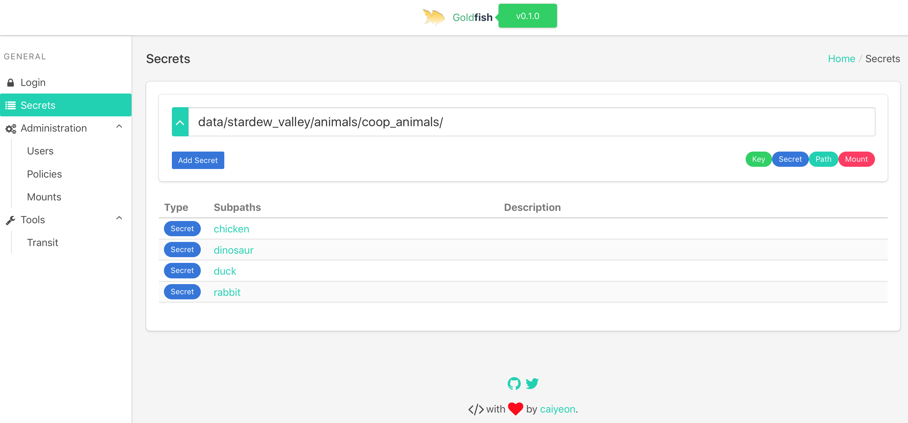
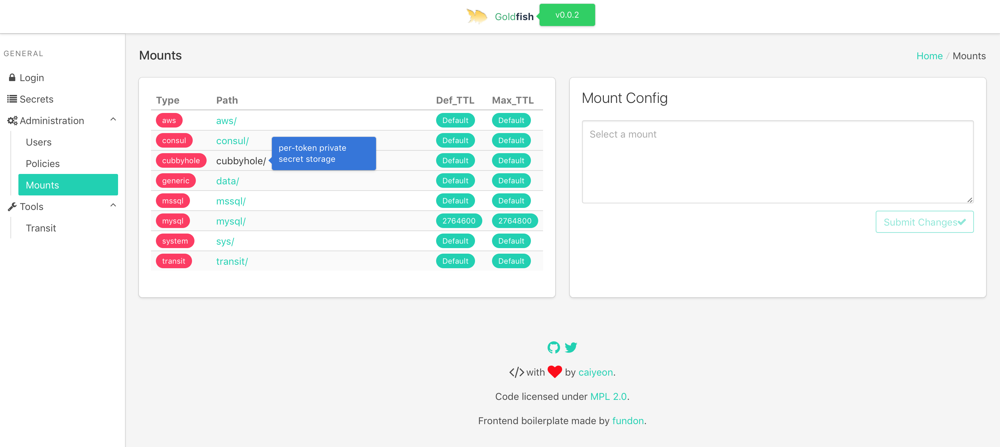

<h3>Goldfish Vault UI - <a href="http://67.205.184.214:8000">Live Demo</a></h3>

## What is this?

Goldfish is a UI for [HashiCorp Vault](https://www.vaultproject.io)

Although Vault's REST API is powerful, certain operations would benefit from a visual representation.

<!--
-->
## Features

* [x] Reading secrets
* [x] Listing users (tokens and userpass)
* [x] Listing policies
* [x] Listing and tuning mounts
* [x] Encrypting and decrypting arbitrary strings (via transit backend)
* [ ] Writing secrets
* [ ] Listing approle role-id and secret-id
* [ ] Login with userpass & more
* [ ] Local settings mapping policy names to labels (for easier user listing visualization)
* [ ] Secret backend specific tools (e.g. AWS backend)

<!--
-->
## Screenshots

<!--
-->
## Components

Frontend:
* VueJS
* Bulma CSS
* Vue Admin

Backend:
* [Vault API](https://godoc.org/github.com/hashicorp/vault/api) wrapper

<!--
-->
## Design

User credentials, upon logging in, are encrypted using the [transit backend](https://www.vaultproject.io/docs/secrets/transit/) and the cipher is sent back as a [secure cookie](http://www.gorillatoolkit.org/pkg/securecookie)

Any future actions from the user will be verified by decrypting the user's cookie with the [transit backend](https://www.vaultproject.io/docs/secrets/transit/) before being validated and used for the action.

Any actions performed (except user credential encryption/decryption via transit) will **only** be done using the user's credentials, and never using the goldfish server's token. This ensures traceability.

If Vault implements CORS, there is a possibility of goldfish becoming serverless, and being shipped as a desktop application using electron.

<!--
-->
## Installation

A full vagrant box simulation script will come soon(TM)

For now, see `scripts` folder for a basic idea of how to setup goldfish

