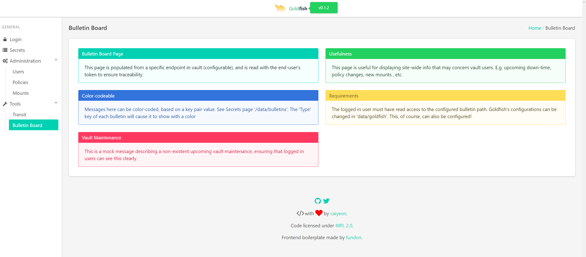
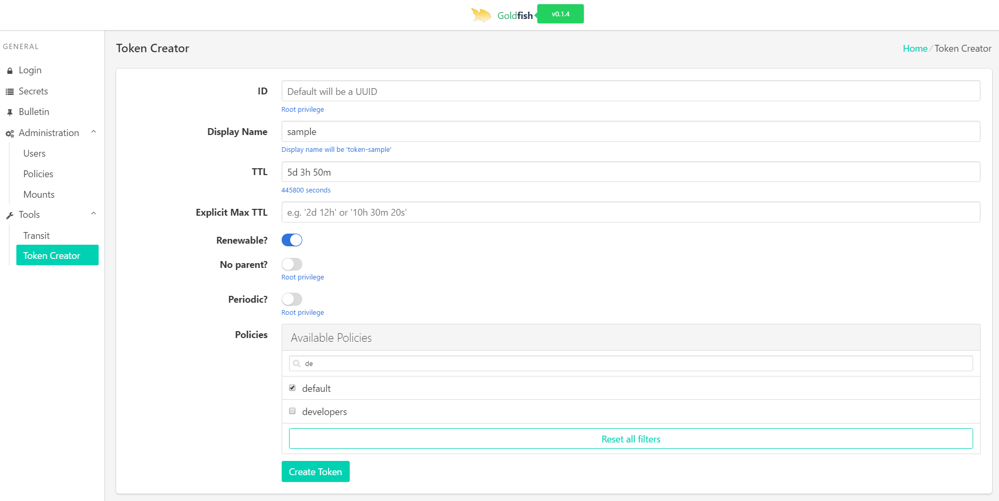
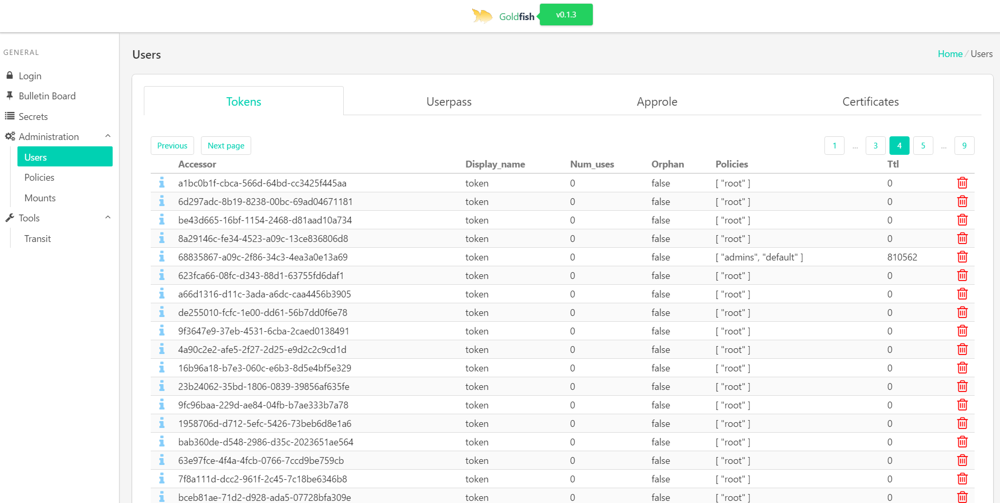

<div align="center">

<h3>Goldfish Vault UI - <a href="https://vault-ui.io">Live Demo </a></h3>

<p></p>

<h3>
	<a href='https://ko-fi.com/A4242ER7' target='_blank'>
		
	</a>
	
	<br>
	Share this repo with your colleagues!
</h3>

</div>


## What is this?

<div class="center">
<blockquote class="twitter-tweet" data-cards="hidden" data-lang="en"><p lang="en" dir="ltr"><a href="https://vault-ui.io">Goldfish</a> - A HashiCorp Vault UI and workflow tool. <a href="https://t.co/uVWLuQEBMi">pic.twitter.com/uVWLuQEBMi</a></p>&mdash; Kelsey Hightower (@kelseyhightower) <a href="https://twitter.com/kelseyhightower/status/899717092496121856?ref_src=twsrc%5Etfw">August 21, 2017</a></blockquote>
</div>

Goldfish answers many auditing and administration questions that Vault API can't:

* Right now, are there any root tokens in Vault?
* Which policies, users, and tokens can access this particular secret path?
* The unseal admins are working from home, but we need a policy changed.
	* How do we generate a root token only for this change, and make sure it's revoked after?
* I store my policies on a Github repo. Can I deploy all my policies in one go? [See more](https://github.com/Caiyeon/goldfish/wiki/Features#request-policy-change-by-github-commit)
* If I remove this secret/policy, will anybody's workflow break?


<!--
-->
## [Deploy goldfish in production in minutes!](https://github.com/Caiyeon/goldfish/wiki/Production-Deployment)

Seriously, the instructions fit on one screen!


<!--
-->
## Features

* [x] Hot-loadable server settings from a provided vault endpoint
* [x] Displaying a vault endpoint as a 'bulletin board' in homepage
* [x] **Logging in** with token, userpass, github, or LDAP
* [x] **Secret** Reading/editing/creating/listing
* [x] **Auth** Searching/creating/listing/deleting
* [x] **Mounts** Listing
* [x] **Policies** Searching/Listing
* [x] Encrypting and decrypting arbitrary strings using transit backend

#### Major features: [See wiki for more](https://github.com/Caiyeon/goldfish/wiki/Features)
* [x] **DONE!** Searching tokens by policy [walkthrough](https://github.com/Caiyeon/goldfish/wiki/Features#searching-tokens)
	- E.g. Display all tokens that have the policy 'admins'
* [x] **DONE!** Searching policy by rule [walkthrough](https://github.com/Caiyeon/goldfish/wiki/Features#searching-policies)
	- E.g. Display all policies that can access 'secret/data*'
* [x] **DONE!** Request & approval based policy changes [walkthrough](https://github.com/Caiyeon/goldfish/wiki/Features#policy-change-requests)
	- Users can place a policy change request in vault
	- Admins must then provide unseal tokens for that specific request
	- Upon reaching a set number, goldfish generates a root token, performs edit, and revokes the root token
* [x] **DONE!** **Terraform your vault** [walkthrough](https://github.com/Caiyeon/goldfish/wiki/Features#request-policy-change-by-github-commit)
	- Fetch a folder of policies from a commit in github
	- Admins can enter their unseal tokens for approval to set vault policies according to policies found
	- Change dozens of policies in one go!
* [x] **DONE!** Resource dependency chain
	- E.g. Will removing a particular policy affect current users?
	- Will removing a mount or secret path affect current users?


<!--
-->
## Screenshots











<!--
-->
## Developing Goldfish

#### Running locally
You'll need go (v1.9), nodejs (v8.2), and npm (v5)

```bash
# hashicorp vault ui

# clone goldfish
go get github.com/caiyeon/goldfish
cd $GOPATH/src/github.com/caiyeon/goldfish

# running goldfish server in -dev will spin up a local vault instance for you
go run server.go -dev

# running goldfish frontend in dev mode will allow for hot-reload of frontend files
cd frontend
sudo npm install -g cross-env
npm install
npm run dev

# a browser window/tab should open, pointing directly to goldfish
```


#### Using a VM
A vagrantfile is available as well

You'll need [Vagrant](https://www.vagrantup.com/downloads.html) and [VirtualBox](https://www.virtualbox.org/). On Windows, a restart after installation is needed.

```bash
# if you wish to launch goldfish in a VM:
git clone https://github.com/Caiyeon/goldfish.git
cd goldfish/vagrant

# this will take awhile
vagrant up --provision

# go to localhost:8080 on your local machine and login with token 'goldfish'

# changes to frontend .vue files will be hot-reloaded
# to force a full reload for the frontend, ssh into the machine and run
#     `sudo systemctl restart goldfish_frontend.service`
# to recompile and re-run the backend, ssh into the machine and run
#     `sudo systemctl restart goldfish.service`
```


#### Compiling
You'll need Go(v1.9), Nodejs (v8.2.0), Npm (v5)

Note that using different versions (of nodeJS, especially) will cause differences in the final binary.

```bash
# download the source code
go get -d github.com/caiyeon/goldfish
cd $GOPATH/src/github.com/caiyeon/goldfish

# resetting to a tagged version is recommended
# no support will be given to arbitrary commits on the master branch
git fetch --all --tags --prune
git checkout tags/<version> # version could be, for example, v0.8.0

# compile the binary
sh build.sh
```


<!--
-->
## Development
Goldfish is in very active development.

Pull requests and feature requests are welcome. Feel free to suggest new workflows by opening issues.


<!--
-->
## Components

Frontend:
* VueJS
* Bulma CSS
* Vue Admin

Backend:
* [Vault API](https://godoc.org/github.com/hashicorp/vault/api) wrapper


<!--
-->
## Design

See: [Architecture](https://github.com/Caiyeon/goldfish/wiki/Architecture)


<!--
-->
## Sponsored by


<!--
-->
## Why 'Goldfish'?

This server should behave as a goldfish, forgetting everything immediately after a request is completed. That, and other inside-joke reasons.

Credits for the goldfish icon goes to [Laurel Chan](https://www.linkedin.com/in/laurel-chan-11baa286)
