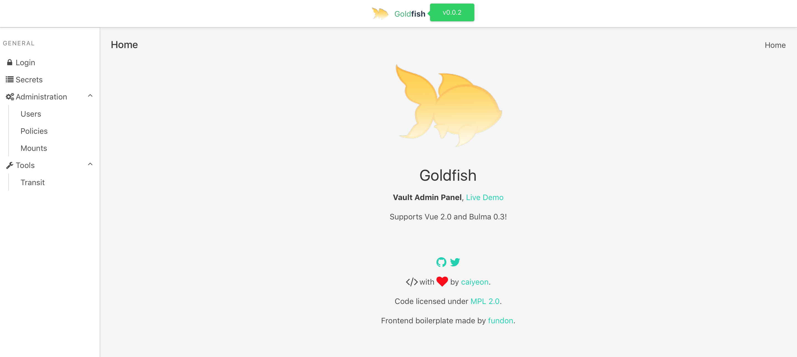

# What is this?

Goldfish is a UI for [HashiCorp Vault](https://www.vaultproject.io)

Although Vault's REST API is powerful, certain operations would benefit from a visual representation of data.

<!--
-->
## Features

* Login via token
* Listing all users (tokens and userpass)
* Listing all policies
* Encrypting and decrypting arbitrary strings

<!--
-->
## Screenshots

<!--
-->
## Components

Frontend:
* VueJS
* Bulma CSS
* Vue Admin

Backend:
* [Vault API](https://godoc.org/github.com/hashicorp/vault/api) wrapper

<!--
-->
## Design

The user logs on by sending credentials (token) to the backend API wrapper, which encrypts the token with Vault's [transit backend](https://www.vaultproject.io/docs/secrets/transit/) before sending it back as a [secure cookie](http://www.gorillatoolkit.org/pkg/securecookie)

Any future actions from the user will be verified by sending the secure cookie to the wrapper, which is validated by [gorilla secure cookie package](http://www.gorillatoolkit.org/pkg/securecookie), and then decrypted using Vault's [transit backend](https://www.vaultproject.io/docs/secrets/transit/) again, before being validated and used for the action.

This does create another component in the workflow where secret information resides in (albeit temporarily). I am not 100% sold on having the backend wrapper, and may completely remove it.

<!--
-->
# Installation

Coming soon (TM)

